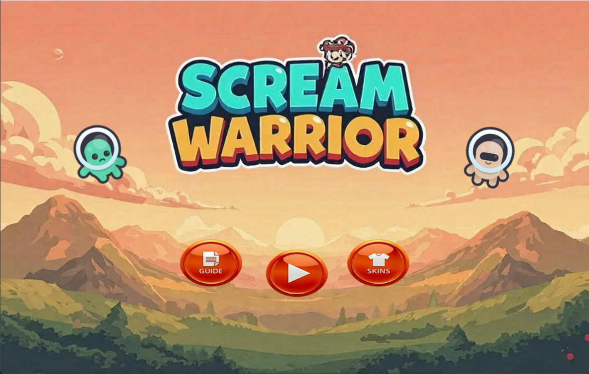
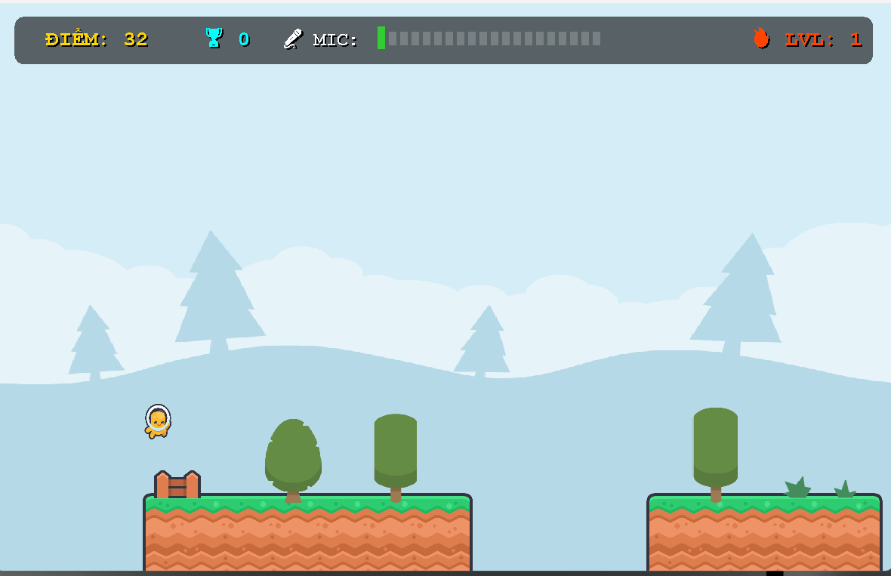
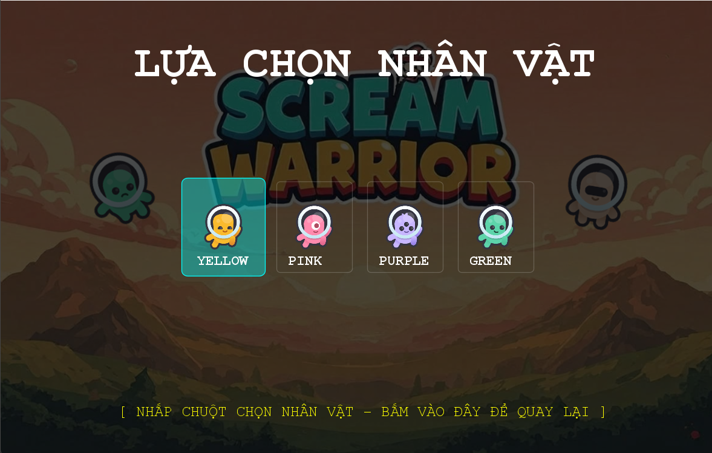

### 🎓 Scream Runner - Voice-Controlled 2D Game
> **Bài tập lớn cuối kỳ môn Lập trình Java - Nhóm [10]**

---

### 👥 Thông tin nhóm (Team Members)

| STT | Họ và Tên | Mã Sinh Viên | Vai trò / Nhiệm vụ | Link GitHub Cá Nhân |
|:---:|---|:---:|---|:---:|
| 1 | Nguyễn Tài Anh Tuấn (Nhóm trưởng) | 3120225170 | Setup Git, Code GUI (GamePanel), Tích hợp logic game, README | [GitHub](https://github.com/Anhtuann1404) |
| 2 | Phùng Tấn Minh | 3120225092 | Code Model (Player, Platform, Enemy), Bắt lỗi va chạm | [GitHub](https://github.com/phgtminh168-pixel) |
| 3 | Nguyễn Hoàng Thắng | 3120225137 | Code Controller (AudioSensor, SoundManager), File I/O | [GitHub](https://github.com/nguyenthang1901) |

---

### 📝 Giới thiệu dự án (Description)
**Scream Runner** là một tựa game 2D Endless Runner độc đáo, phá vỡ lối chơi dùng bàn phím truyền thống bằng cách **sử dụng Microphone** để điều khiển. 

Người chơi sẽ dùng âm lượng từ giọng nói của mình để tương tác: phát ra âm thanh nhỏ để nhân vật đi bộ, và "hét" thật to để nhân vật nhảy cao vượt qua các chướng ngại vật (Ong, Cưa, Thiên thạch) cũng như thu thập các đồng xu trên cao. Dự án không chỉ mang tính giải trí cao mà còn áp dụng triệt để các kiến thức lập trình hướng đối tượng (OOP) và xử lý luồng (Thread) trong Java.

---

### ✨ Các chức năng chính (Features)
- [x] **Cơ chế nhận diện âm thanh:** Sử dụng `TargetDataLine` để đo cường độ âm thanh từ Mic theo thời gian thực (Real-time).
- [x] **Sinh bản đồ động (Procedural Generation):** Địa hình (Platform), bẫy và phần thưởng được sinh ngẫu nhiên liên tục dựa trên điểm số hiện tại.
- [x] **Hệ thống Độ khó (Difficulty Scaling):** Tốc độ game và tần suất xuất hiện chướng ngại vật tăng dần theo Level.
- [x] **Lưu trữ Kỷ lục (File I/O):** Tự động đọc và ghi điểm Highscore (Kỷ lục cao nhất) vào file text cục bộ, dữ liệu không bị mất khi tắt game.
- [x] **Kiến trúc chuẩn MVC:** Tách biệt hoàn toàn logic vật lý của game (Model) khỏi giao diện hiển thị (View) và bộ xử lý tín hiệu (Controller).
- [x] **Xử lý Đa luồng (Multithreading):** Luồng lắng nghe âm thanh chạy độc lập với luồng render đồ họa (60 FPS), đảm bảo game không bị giật lag.

---

### 💻 Công nghệ & Thư viện sử dụng (Technologies)
* **Ngôn ngữ:** Java (JDK 17+)
* **Giao diện:** Java Swing, AWT (`Graphics2D` để vẽ sprite, hạt rụng).
* **Xử lý Âm thanh:** `javax.sound.sampled` (Đọc Mic & Phát SFX).
* **Lưu trữ:** File I/O cơ bản (`BufferedReader`, `BufferedWriter`).
* **Quản lý mã nguồn:** Git & GitHub.

---

### 📂 Cấu trúc thư mục (Project Structure)
Mã nguồn được tổ chức chặt chẽ theo mô hình **MVC (Model - View - Controller)**:

```text
📦 src
 ┣ 📂 com.game.model       # Chứa các thực thể vật lý (Player, Platform, Coin, Bee, Meteor...)
 ┣ 📂 com.game.view        # Chứa giao diện game (GamePanel, vẽ HUD, xử lý khung hình)
 ┣ 📂 com.game.controller  # Chứa bộ xử lý tín hiệu (AudioSensor đo Mic, SoundManager phát nhạc)
 ┗ 📜 Main.java            # Khởi tạo JFrame và chạy ứng dụng
### 🚀 Hướng dẫn cài đặt và chạy (Installation)

**1. Yêu cầu hệ thống (Prerequisites)**

* **Java Development Kit (JDK):** Phiên bản JDK 17 trở lên.
* **Phần mềm lập trình (IDE):** Khuyên dùng Eclipse, IntelliJ IDEA hoặc Visual Studio Code.
* **Phần cứng bắt buộc:** Máy tính cần có Microphone và đã được cấp quyền ghi âm.

**2. Tải mã nguồn về máy (Clone Repository)**

Mở Terminal hoặc Git Bash và gõ lệnh sau:

```bash
git clone https://github.com/Anhtuann1404/JavaFinal.git

```
<h2 align="center">Demo Game</h2>

<p align="center">
  
</p>

<p align="center"><b>Menu của game</b></p>

<p align="center">
  
</p>

<p align="center"><b>Màn hình gameplay</b></p>

<p align="center">
  
</p>

<p align="center"><b>Chọn skin nhân vật</b></p>

